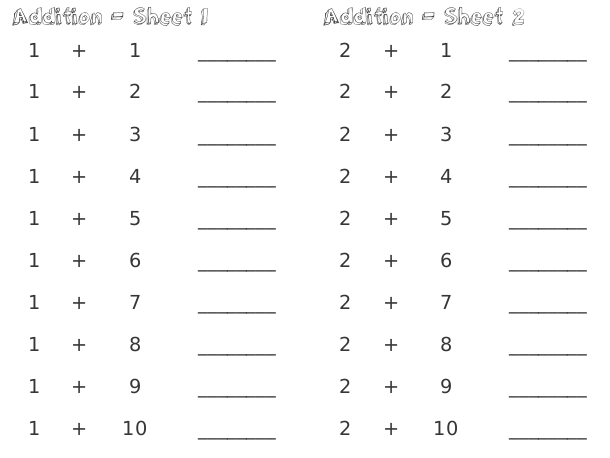

## Welcome to Mathamon!
It is a very simple and naive tool to generate Math worksheets for Kids. I had seen my nephew working on Mathematic sheets purchased bundles with simple randomness and numericals. So, I thought of a simple tool to help generate these sheets with the choice of my aunt. Any parent can use this tool to generate Math Sheets.

**This tool is still, a Python Script not an executable as of now**
## To-Do
* Simple Executable
* Configuration UI

## Requirements
* Python 3.5+
* Firefox 60+ or any Chrome version
*This scripts was tested on Windows and Linux Platform running Python 3.5+ and Firefox browser*

## Requirements -- Python Packages
* [beaitifulsoup4](https://www.crummy.com/software/BeautifulSoup/bs4/doc/)
* **Optional** [pdfkit](https://pypi.org/project/pdfkit/)
* **If using PDFKit** [wkhtmltopdf](https://wkhtmltopdf.org/usage/wkhtmltopdf.txt)
I ran into a lot of trouble setting up PDFKit on Windows, so the easiest solution for a cross-platform execution was opening the generated HTML and print from the browser.

## How to generate Sheets?

* Each A4 page has **4 worksheets** dividing the page into 4 divisions.
* Each worksheet has **10 numericals**.
* So dependency file is the **config.py**.
* So when generating sheets it is always good to choose pairs in multiples of 10.

```python
'''
	Number Definitons
'''
general_nos = list(range(1,11))
easy_nos = list(range(1,6))
tougher_nos = list(range(11,16))

sheet_number = 3
# Easy Pairings
for i in easy_nos:
	easy_pairs.extend(list(map(lambda x: [i,x] , general_nos)))
# Tough Safety Pairs	
for i in range(0,10):
	safety_pairs.append(sample(tougher_nos, k=2))
for i in range(0,10):
	safety_pairs.append(sample(tougher_nos, k=2))
# Random Pairings
for i in range(0,50):
	random_pairs.append(sample(general_nos, k=2))

'''
	Numbers Pairs Passed to Generator
'''
all_pairs = easy_pairs + random_pairs + safety_pairs
```
* **General Numbers** :		__________ + generalNumber, range(1-10) is the place holder for generalNumber
* **Easy Numbers** : 		EasyNumber + _____________ , range(1-5), is the place holder for EasyNumber
These Numbers contribute on what pairs do you need the worksheets [All in Order]
so in the setting above, 
```
(1+1), (1+2) ... (1+10)
(2+1), (2+2) ... (2+10)
....
....
(5+1), (5+2) ... (5+10)
```
* **Easy Pairs** : The pairs above are the easy pairs, which are by default in order.

* **Tougher Numbers** : 	Difficult Numbers range, these are randomized and filled into workseets.
* **Safety Pairs** : 	Are Placeholders if any worksheets are left empty in a page, generated from **Tougher Numbers**
* **Random Pairs**: 	Assorted Pairs generated from the **general Numbers**

## Running the code
```python
# Change python config.py for any settings for your worksheets

# Install required packages
pip install -r requirements.txt

# Run The sheetGenerator.py
python sheetGenerator.py
```
* Open the `Sheet_<date>.html` in your browser and give print.

## References
* [Beautiful Soup Docs](https://www.crummy.com/software/BeautifulSoup/bs4/doc/)
* [Random Module](https://docs.python.org/3/library/random.html)
* [pdfkit docs](https://pypi.org/project/pdfkit/)

## Credits
* [Bulma CSS](https://bulma.io/) - The simplest CSS Library and an amazing one.

Beautiful Fonts from the following,
* [3Dumb](https://www.fontsquirrel.com/fonts/3Dumb)
* [Mousie](https://www.1001fonts.com/mousie-font.html)
* [Garanimals](https://www.1001fonts.com/garanimals-font.html)
**All fonts intended for personal use only**

*Give a ★ if you found the Tool useful, Thank You!*
